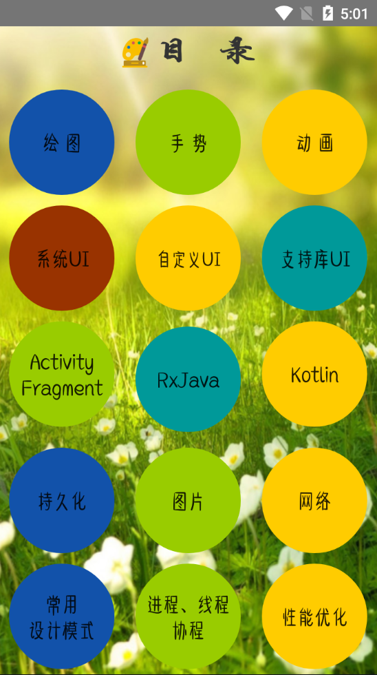
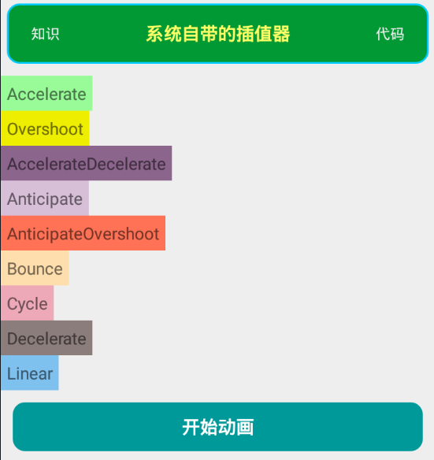
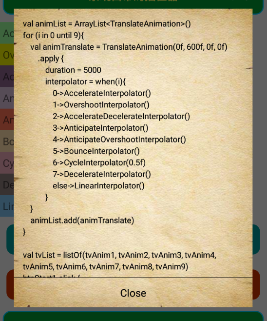
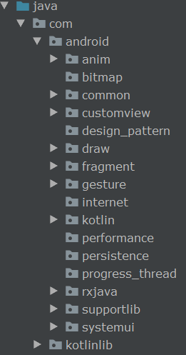

## Android开发Demo大全集（持续更新中）

#### 目录

#### DEMO实例

#### 代码阅览

#### 项目结构

##### anim 动画
##### bitmap 图片
##### common 通用文件
##### customview 自定义view
##### design_pattern 设计模式
##### draw 绘图
##### fragment 
##### gesture 手势
##### internet 网络
##### kotlin
##### performance 性能优化
##### persistence 持久化
##### progress_thread 进程和线程
##### rxjava
##### supportlib 支持库控件
##### systemui 系统控件
